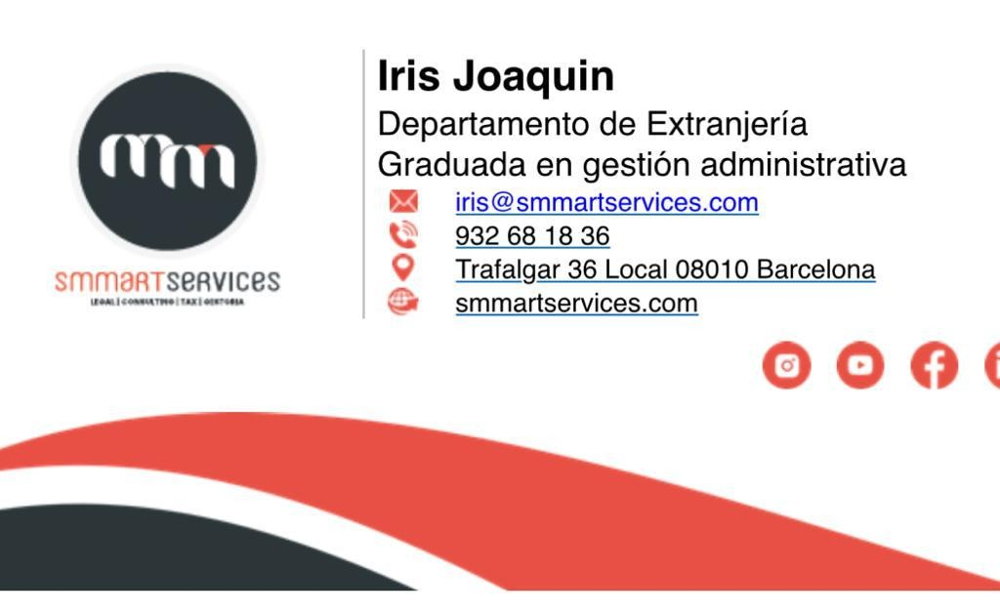

# 🇪🇸 Espanha


Estas informações podem estar desatualizadas e são apenas uma orientação.


Espanha apesar de ser um pais pequeno comparado com o Brasil, tem muita diversidade de culturas e costumes. Geralmente há mudanças culturais e até de idioma dependendo da comunidade autônoma que você estiver. Por exemplo, na Catalunha é comum falar catalão e é o idioma predominante em muitos municípios.

Custo de vida em geral na Espanha:


numbeo.com


## Cidades


[valencia.md](valencia.md)


## Documentação e burocracia

Na Espanha a burocracia a nível estatal é complicada, com falta de informação e até em alguns casos, loopings que parecem não ter saída. Se você as vezes se sente perdido ou percebe que as coisas não fazem sentido, **é normal**.

### Definições básicas

* **DNI**: Documento Nacional de Identificación. Este só tem quem tem a nacionalidade espanhola
  * [**DNIe**](https://www.dnielectronico.es/PortalDNIe/): o mesmo que antes mas o eletrônico
* **NIE**: Número de Identificación de Extranjero. Este é o número que você vai obter enquanto não tem o **DNI**
* **TIE**: Tarjeta de Identificación de Extranjero. Este é o documento que irá associado (impresso nele) o **NIE**
* [**Certificado digital**](https://www.sede.fnmt.gob.es/certificados/persona-fisica)**:** Isto permite a você fazer quase todas (pode até que todas) as burocracias online
* [Cl@ve](https://clave.gob.es/clave\_Home/clave.html): Isto também permite fazer burocracias online, mas nem todas
* [**Padrón/Empadronamiento**](https://administracion.gob.es/pagFront/tramites/fichaTramite.htm?idTramiteSeleccionado=3485\&idMateria=21\&idBoletin=21): Este documento certifica onde você mora e é necessário para a maioria de processos burocráticos na Espanha. O local para se registrar e pedir o certificado depois do registro, é a prefeitura (_ayuntamiento_) do município que você more.
* [**Número de Seguridad Social**](https://www.seg-social.es/wps/portal/wss/internet/Inicio): Um sistema obrigatório que protege os cidadãos espanhóis em caso de necessidade, fornecendo benefícios como desemprego, licença médica ou aposentadoria.\
  Você vai obter este número quando começar a trabalhar. Geralmente é a empresa quem _da de alta_ (e faz toda a gestão) isto.
* [**Vida Laboral**](https://portal.seg-social.gob.es/wps/portal/importass/importass/Categorias/Vida+laboral+e+informes): Contem as informações sobre os empregos que tem/teve na Espanha, como se fosse uma carteira de trabalho

Existe o caso de você poder ter um número associado de **NIE** quando dá entrada em um tipo de residência (a mais comum) e somente depois de aprovado o processo, você poder pegar o **TIE.**

#### Segurança em documentos

Ao compartilhar documentos de forma online, se recomenda seguir algumas instruçoes por segurança. Você pode ver aqui como debe ser feito no caso do DNI:

<figure><figcaption>
Como compartilhar copia de DNI na internet 
</figcaption></figure>

Referencias:&#x20;

[https://x.com/policiaelche/status/1660541163034517505](https://x.com/policiaelche/status/1660541163034517505)



### Policia

Muitas vezes pode ser difícil fazer os diferentes processos e burocracias para obter a documentação que você precisa.


Sempre é aconselhável contratar advogados especialistas em _extranjería_ para resolver a documentação.


### Nacionalidade

Para os brasileiros, a obtenção da cidadania espanhola torna-se viável após residirem legalmente na Espanha por um período de 2 anos (obtenção do TIE).&#x20;


A lista abaixo não é definitiva, visto que a lista de documentos varia caso a caso (e.g. nacionalidade do aplicante).


Abaixo é apresentada uma lista não-exaustiva dos documentos solicitados para o processo de cidadania espanhola por residência:

1. Certidão de nascimento **inteiro teor** (apostilada e traduzida)
2. Certidão de casamento (apostilada e traduzida)
3. Certidão de antecedentes criminais
   1. Brasileira (apostilada e traduzida)
   2. De países resididos antes de se mudar para a Espanha (esse requisito é discutível, pois algumas pessoas aplicam sem, outras com, não há consenso 🤷‍♂️)
4. Histórico de empadronamento
5. Certificado DELE (_apenas para aplicantes oriundos de países que não tem o espanhol como língua oficial_)
6. Certificado CCSE
7. Resolucao de concessao de autorizacao de residencia
8. TIE
9. Passaporte

> Se você residiu na Alemanha 🇩🇪, sugere-se ver [essa seção](../../germany.md#solicitando-um-fuhrungszeugnis-no-exterior), que explica o processo para solicitar a certidão de antecedentes criminais alemã (_Führungszeugnis_) apostilada quando já não se vive mais na Alemanha.

#### Certificados CCSE e DELE A2

Um dos requisitos essenciais é a comprovação do conhecimento da cultura e do idioma espanhol. Para atender a essa exigência, são aplicadas duas provas, a CCSE e a DELE A2, ambas sob a coordenação do Instituto Cervantes, entre outras opções disponíveis.

* **Dicas para CCSE**: A CCSE é a prova de conhecimentos gerais, composta por um banco de 300 perguntas que não passam por alterações frequentes. Nesse contexto, a principal sugestão é realizar simulados de maneira exaustiva, uma vez que as questões apresentadas serão precisamente aquelas constantes no banco de perguntas. Aplicativos oficiais para [Android](https://play.google.com/store/apps/details?id=com.institutocervantes.pruebaccse\&pli=1) e [iOS](https://apps.apple.com/es/app/ccse-nacionalidad-espa%C3%B1ola/id1461069757).                  \[+] Informações: [https://examenes.cervantes.es/es/ccse/que-es](https://examenes.cervantes.es/es/ccse/que-es)
* **Dicas para DELE A2**: O DELE A2 é o exame que atesta sua competência nas normas linguísticas básicas do espanhol, abrangendo a compreensão e interpretação de áudios e textos, além da expressão oral. Embora mais extenso, o exame não apresenta complexidades significativas. Ele está estruturado em quatro etapas distintas:

1. Interpretação de textos (\~60 minutos, com lápis)
2. Compreensão auditiva (\~40 minutos, com lápis)
3. Redações (\~50 minutos, com caneta): A parte escrita da prova envolve a redação de um e-mail na tarefa 1, o que se resume a praticar alguns exemplos. Quanto à tarefa 2, há a opção de escolher entre discorrer sobre sua música e cantor favoritos ou compartilhar sobre as férias que gostaria de desfrutar.
4. Prova de fala (\~10 minutos). A dica é: siga as instruções da prova e em ordem.
   1. Monólogo - Falar livremente de 2 a 3 minutos de um tema a escolher: No meu caso foram sobre ou a cidade que vivo ou minha infância;
   2. Descrever uma foto. São dadas 2 para a escolha.
   3. Conversa com o examinador.

\[+] Informações e materiais oficiais: [https://www.mjusticia.gob.es/es/ciudadania/tramite?k=solicitud-nacionalidad-espanola-residencia](https://www.mjusticia.gob.es/es/ciudadania/tramite?k=solicitud-nacionalidad-espanola-residencia), [https://examenes.cervantes.es/es/dele/examenes/a2](https://examenes.cervantes.es/es/dele/examenes/a)

### Mudança de NIE a DNI

Lugares importantes onde mudar

* _Seguridad social_
  * Online: [_Enviar solicitud_](https://portal.seg-social.gob.es/wps/portal/importass/importass/inicio?1dmy\&urile=wcm%3apath%3a/wps/wcm/connect/importass/importass\_contenidos/solicitudes/enviar)
* Agencia tributaria
  * Online: [_Modelo 030_](https://sede.agenciatributaria.gob.es/Sede/procedimientoini/G321.shtml)
* Bancos
  * BBVA é presencial atualmente (jan/24)
* Posto de saúde (presencial)
  * Comunidad Valenciana (GVA)
    * Você pode receber uma mensagem que o novo cartão está pronto e dai é só ir buscar
* _Empadronamiento_/Prefeitura (presencial)
  * A priori com mudar o padrón, automaticamente no período de um mês, você deve aparecer no [_Censo Electoral_](https://sede.ine.gob.es/ss/Satellite?c=Page\&cid=1254734719723\&lang=es\_ES\&p=1254734719723\&pagename=SedeElectronica%2FSELayout)_._ Se não aparecer, ir na _Sede Electrónica_ do INE e procurar fazer via digital.

Outros lugares de interesse

* Contas de compras online
  * Consum tem um formulário pra trocar diretamente no site. Quando solicitar, que seja tanto a mudança no sistema de Sócio como no sistema de compra online (tienda.consum.es)
* O2 e provavelmente outras companhias: cuidado pra que façam a transferência de todos os produtos juntos. Exemplo: celular + fibra. É possível que façam por separado e que você fique com o celular no NIE e a fibra com o DNI

### Visto de nômade digital

A comunidade do Slack atualmente (2023) sabe pouco sobre o assunto. Por favor contate um profissional para que possa te auxiliar.

### CNH (carteira)

O processo de troca da CNH entre Brasil e Espanha é relativamente simples, devido a um acordo de equivalência entre os dois países. No entanto, o desafio muitas vezes reside em obter um agendamento (cita) na DGT (Dirección General de Tráfico).

Devido à possibilidade de transcorrer um período considerável entre o desejo de agendar a troca (obter uma cita) e efetivamente realizar a visita à DGT, é importante considerar a validade de sua CNH atual. Caso ela esteja prestes a vencer, pode ser mais conveniente renová-la no Brasil. Isso ocorre porque, de acordo com a interpretação comum da legislação atual:

> É necessário que a emissão da **primeira** carteira de habilitação no Brasil tenha ocorrido em uma data anterior à sua chegada à Espanha.

Essa regra se deve ao fato de que, durante o processo de troca, a DGT leva em consideração a **data de emissão** da CNH brasileira.

Para realizar o trâmite, é necessário providenciar os seguintes documentos:

* Duas fotos 3x4 (carnet);
* Certificado médico psicotécnico,
  * É possível economizar nesse processo ao aproveitar descontos de até 50% oferecidos em sites de cupons, e.g.: https://www.groupon.es/deals/centre-medic-sagrada-familia-1

Se optar por seguir o processo por conta própria, é fundamental acessar o site de agendamento de citações da [DGT](https://sedeapl.dgt.gob.es/WEB\_NCIT\_CONSULTA/consultacanjes/consultarCitaCanjes.faces) e ficar monitorando diariamente por vagas.

> Uma estratégia eficaz para encontrar uma vaga de agendamento é utilizar bots disponíveis no Telegram e no Twitter, que compartilham diariamente as vagas disponíveis em grupos dedicados.

Para obter informações detalhadas sobre todo o processo, recomenda-se visitar o site oficial da [DGT](https://sede.dgt.gob.es/es/permisos-de-conducir/canje-permisos/canje-permisos-extranjeros/canje-permisos-con-convenio/index.shtml?Brasil.).

Caso possua dúvidas mais específicas, é possível entrar em contato com gestores que já foram contatados por membros da comunidade no Slack e que possuem experiência no assunto.

Gestores

* Iris Joaquin: 
  * Valor do trâmite: 200,00 EUR (IVA + taxa DGT inclusa)
  * Tempo de espera: (?)
* [Gestmotor](https://gestoriatrafico.es/)
  * Valor do trâmite: 79,90 EUR (IVA + taxa DGT inclusa)
  * Tempo de espera: 2-5 meses

### Bancos

Você vai precisar de uma conta no banco para receber salário de trabalho (de qualquer empresa seria que não pague em espécie).\
Alguns deles são:

| Espanhóis                                       | Internacionais                                                                    | Online                                              |
| ----------------------------------------------- | --------------------------------------------------------------------------------- | --------------------------------------------------- |
| [BBVA](https://www.bbva.es/)                    | [ING](https://www.ing.es/)                                                        | [Revolut](https://www.revolut.com/es-ES/)           |
| [Caixa Bank](https://www.caixabank.es)          | [Citibank](https://www.citi.com/)                                                 | [OpenBank](https://www.openbank.es/) (by Santander) |
| [Banco Sabadell](https://www.bancsabadell.com/) | [Deutsche Bank](https://dbonline.deutsche-bank.es/portalserver/olbesportal/login) | [N26](https://n26.com/es-es)                        |
| [Santander](https://www.bancosantander.es/)     | [HSBC](https://www.hsbc.es/)                                                      |                                                     |

A maioria dos bancos vão denegar ou complicar o processo se você disser que só tem o passaporte para abrir a conta. Muita gente já comentou que o Sabadell é uns dos que permite usar o passaporte sem tanto problema.

### Utilidades

* Bot no Telegram pra informar de novas citas em algumas prefeituras: [https://t.me/ayuinfo\_bot](https://t.me/ayuinfo\_bot)
* Bot no Telegram para informar de novas citas na policia. Útil para _extranjería_: [https://t.me/check\_cita\_bot](https://t.me/check\_cita\_bot)
* Buscador de citas para varios assuntos. Serviço pago a partir de 25 Euros. [https://www.robotcita.com/](https://www.robotcita.com/)
* [Mi carpeta ciudadana](https://masinformacioncarpeta.carpetaciudadana.gob.es/infocc/es/masInformacion.html): Aplicação que concentra muitas das informações das diferentes administrações (_ayuntamientos_, _comunidades_ e _estado_) para o cidadão

## Trabalho

### Salários

Uma referencia rápida é que na Espanha em geral os salários são mais altos que Portugal mas mais baixos que países como Países Baixos, Alemanha e UK.

Nas cidades onde se paga mais e tem mais oportunidade é Madrid e Barcelona

### Portais de emprego

* LinkedIn
* [InfoJobs](https://www.infojobs.net/)
* [Manfred](https://www.getmanfred.com/ofertas-empleo?onlyActive=true\&currency=%E2%82%AC)

### Impostos

O IRPF é o _Impuesto sobre la Renta de las Personas Físicas_. Este geralmente é o que te descontam na folha de pagamento na Espanha e o que você tem que declarar todo ano.

Para calcular o que te corresponde declarar e pagar de imposto a partir do que você recebe, tem este link: [https://www.bbva.es/finanzas-vistazo/ef/empresas/tramos-irpf.html](https://www.bbva.es/finanzas-vistazo/ef/empresas/tramos-irpf.html)

Para calcular os descontos na folha de pagamento, use o [AfterTaxes](https://salaryaftertax.com/es/salary-calculator). Ele é bem preciso

### Lei de Beckham

Lei similar aos 30% rulling da Holanda, o qual fixa o imposto que você paga em 24%, ele começa a valer a pena se o salario for maior que € 60.000 ano.

Requisitos:

* Não ter sido residente fiscal na espanha nos ultimos 5 anos.
* Ter um contrato de trabalho espanhol ou obter o visto de nomade digital

Como solicitar:

* Ter a Cl@ve
* Apresentar o [formulário 030](https://sede.agenciatributaria.gob.es/Sede/en\_gb/censos-nif-domicilio-fiscal/declaraciones-censales-modelo-030.html)
* Apresentar o [formulário 149](https://sede.agenciatributaria.gob.es/Sede/en\_gb/procedimientoini/G606.shtml) com os seguintes documentos
  * Contrato, contra cheque, Vida Laboral, NIE, Passaporte completo (incluindo paginas em branco)
* Espere a aprovação (geralmente é rápido, por volta de 10 dias)
* Apresente a confirmação para o RH da sua empresa

### Empresas

Em Espanha a maioria das empresas são consultoras. Depois tem uma parte de multinacionais ou empresas grandes (bancos) como Cabify, Glovo, OpenBank, etc. E por último tem empresas de produto pequeno ou médio. Pela parte das consultoras, tem de tudo. Desde as conhecidas Big Four que na sua maioria fazem [exploração dos desenvolvedores](https://www.elconfidencial.com/empresas/2023-01-16/redada-trabajo-big-four-control-horarios\_3557071/), outras que vai depender do projeto e outras que são OK/boas. Para ter uma referência das consultoras, se pode consultar o site [Malditas Consultoras](https://malditasconsultoras.com/) ou o Glassdoor.

Uma quarta opção são as empresas de outros países da Europa (exemplo Alemanha ou UK) que tenham sede em Espanha.

## Moradia

### Portais

#### Larga duração

Dos mais populares aos menos

* [Idealista](https://www.idealista.com/)
* [Fotocasa](https://www.fotocasa.es)
* [Habitaclia](https://www.habitaclia.com/)
* [Engel\&Volkers](https://www.engelvoelkers.com/es/)
* [Pisos.com](https://www.pisos.com/)
* [Yaencontre](https://www.yaencontre.com/) (este reposta no Wallapop com um bot, é um inferno isso)

Sites que oferecem mais opções de aluguel direto com proprietário (mais difícil)

* [Wallapop](https://es.wallapop.com/)
* [Milanuncios](https://www.milanuncios.com/)

Serviços que exageram em preços&#x20;

* [Sttepping stone](https://www.steppingstonerentals.com/)
* [Dasha living space](https://dashalivingspace.com/)

#### Curta estadia

* [Homelike](https://www.thehomelike.com/es/)
* [Spotahome](https://www.spotahome.com/es)
* [Nestpick](https://www.nestpick.com/es/)
* [HousingAnywhere](https://housinganywhere.com/es/)

#### Quarto

* [Badi](https://badi.com/es/)
* [Piso compartido](https://www.pisocompartido.com/)

### Aluguel

A maioria dos aluguéis é por imobiliária, que complica para quem aluga mas oferece mais segurança ao proprietário. Estes são alguns dos requisitos mais comuns:

* Contrato/fonte de renda estável
* Que o valor do aluguel não seja mais de 30% do salário
* Valores:
  * Um mês de aluguel adiantado
  * Um caução (_fianza_)
  * Um mês pra imobiliária (é tipo uma taxa, não devolve). Este ponto mudou com a nova [Lei de Vivienda](https://www.lamoncloa.gob.es/serviciosdeprensa/notasprensa/transportes/Paginas/2023/170523-ley-derecho-vivienda-aprobacion-definitiva.aspx), mas as imobiliárias dão _jeitinhos_ pra cobrar. Da pra reclamar a posteriori, mas pode-se estender a vias legais.
* Documentos de identidade. Todas deveriam aceitar o passaporte, mas pode ser que algumas não gostem ou seja um ponto negativo não ter o NIE/DNI

É possível que algumas imobiliárias peçam mais meses adiantados de aluguel, dependendo do seu perfil ou dos procedimentos deles, mas não e o padrão.


Ao alugar, perguntar se o imóvel é registrado como residência. Se não, não vai poder fazer o Empadronamiento.


A seguir una lista de sindicatos de _inquilinos_ de aluguel, por se precisarem orientação legal ou reclamar direitos:

* Madrid [https://www.inquilinato.org/](https://www.inquilinato.org/)
* Barcelona (e por enquanto Valencia também) [https://sindicatdellogateres.org/](https://sindicatdellogateres.org/)

### Compra/Hipoteca

* Link de pessoa do TikTok que fez tudo sozinha: [https://taplink.cc/ytusinfiltro](https://taplink.cc/ytusinfiltro). Perfil no TikTok: [https://www.tiktok.com/@ytusinfiltro](https://www.tiktok.com/@ytusinfiltro)
* Serviço de acompanhamento feito por Elaine: [http://investirnaespanha.com/](http://investirnaespanha.com/)
* Serviço de acompanhamento e consultas feitos por Montse Cespedosa: [https://montsecespedosa.com/](https://montsecespedosa.com/)

### Mudança

#### Troca endereço

Tenha em conta que você terá que trocar o endereço em todos os serviços possíveis

* _Empadronamiento_/Prefeitura (presencial)
*   No sistema da RedSara, é possível fazer a mudança de maneira prática em vários lugares, só que este sistema depende do que seu endereço esteja atualizado no INE. Esta atualização acontece em até 2 meses depois que você mudou o _padrón_.\
    Caso você queira fazer por ali, deixo aqui o link e um print de como é.\
    [https://cambiodomicilio.redsara.es/pcd/public/login.xhtml](https://cambiodomicilio.redsara.es/pcd/public/login.xhtml)\\

    <figure><figcaption>
Sistema RedSara para mudança de domicilio
</figcaption></figure>
* Bancos
  * BBVA é presencial atualmente (jan/24)
* Saúde
  * Comunidad valenciana (GVA): Procedimento [https://www.gva.es/es/inicio/procedimientos?id\_proc=95185](https://www.gva.es/es/inicio/procedimientos?id\_proc=95185)
* Contas de compras online
* Companhias de telefone e internet

#### Frete/Serviços

* [Sirelo](https://sirelo.es/)

### Serviços

#### Internet e telefone

A Espanha é um pais que investiu muito na rede de fibra em todo o território, então a velocidade da internet aqui é bastante boa.

Operadoras:

* Mais conhecidas e ~~caras~~ completas
  * [Movistar](https://www.movistar.es/). A melhor
  * [Orange](https://www.orange.es/). Ok, mas enchem um pouco o saco com o marketing
  * ~~Vodafone~~. Evite esta a qualquer custo
* As secundarias, conhecidas como a _gama média_ e as vezes filiais das anteriores
  * [O2](https://o2online.es/). Usa tudo da Movistar mas não tem nada de TV ou aparelhos
  * [Digi](https://www.digimobil.es/). Varias pessoas tem e não houveram reclamações
  * [Pepephone](https://www.pepephone.com/). Parece que da bom serviço também

A maioria das pessoas na Espanha usa a opção de contrato ao invés de pré-pago para celular.

Se você recebe ligaçoes indesejadas, pode se cadastrar na [Lista Robinson](https://www.listarobinson.es/). Se continuar, pode até denunciar [https://www.youtube.com/watch?v=z61qFVV8X4w](https://www.youtube.com/watch?v=z61qFVV8X4w).

#### Luz

Comparadores de tarifas de luz

* [https://www.simuladorfacturaluz.es/comparador-tarifas-luz/](https://www.simuladorfacturaluz.es/comparador-tarifas-luz/)
* [https://www.grinchenergetico.es/simulador\_web.html](https://www.grinchenergetico.es/simulador\_web.html)

### Outros

Pra evitar os pisos turísticos: [https://www.instagram.com/lamataobras/](https://www.instagram.com/lamataobras/)

## Saúde

### Saúde pública

O sistema de saúde pública espanhol é gratuito e se pode ter acesso ao completo assim que estiver registrado na _Seguridad Social_.

Tem comunidades autônomas que ainda que ainda não sendo registrado ou mesmo _ilegal_, atendem em urgências.

Nos últimos anos (2023 para atrás), o sistema pública tem sofrido alguns cortes e falta profissionais, então em alguns casos podem existir pequenas demoras para um agendamento geral e demoras longas para especialistas. Isto vai depender do município que você more.

### Seguro de saúde privado

Geralmente os seguros de saúde privados mais recomendados pela comunidade são de:

* [Sanitas](https://www.sanitas.es/)
* [Adeslas](https://www.segurcaixaadeslas.es/)
* [DKV](https://dkv.es/particulares)

## Família

### Escolas

Existe esta plataforma pra ver que escolas tem nas cidades e de que tipo são (concertadas, públicas, laicas, religiosas, etc): [https://www.micole.net/](https://www.micole.net/)

## Transporte

### Trem

* [Renfe ](https://www.renfe.com/es/es)(estatal)
  * Curiosidade: Se ele atrasar, pode [pedir reembolso](https://www.renfe.com/es/es/ayuda/compromiso-puntualidad)
* [Trainline](https://www.thetrainline.com/es). Plataforma para comparar as diferentes empresas

### Taxi

* [FreeNow](https://www.free-now.com/es/)
* [Cabify](https://cabify.com/es)

### Aluguel meios de transporte

* [Cooltra](https://cooltra.com/es/) (motos)
* [FreeNow](https://www.free-now.com/es/) (dependendo da cidade)

## Lazer

### Compras

* Ofertas postadas pelos usuários. Igual ao Pelando do Brasil: [Chollometro](https://www.chollometro.com/)

#### Usado (segunda mano)

* [Wallapop](https://es.wallapop.com/)
* [Milanuncios](https://www.milanuncios.com/). Este portal tem mais anônimos, você pode encontrar pessoas não tão legais.
* [Vinted](https://www.vinted.es/). Foco em roupa, calçados e acessórios

#### Mercado

* [Mercadona](https://www.mercadona.es/)
* [LIDL](https://www.lidl.es/)
* [Aldi](https://www.aldi.es/)
* [Dia](https://www.dia.es/) (tem parceria com Amazon)
* [Carrefour](https://www.carrefour.es/) e [Carrefour Express](https://www.carrefour.es/tiendas-carrefour/supermercados/carrefour-express/)
* [Alcampo](https://www.alcampo.es/compra-online/)
* [Eroski](https://www.eroski.es/) (não tem em todas as cidades)
* [Consum](https://tienda.consum.es/es) (mais forte na Comunidad Valenciana e no geral leste da Espanha)
* [El Corte Inglés](https://www.elcorteingles.es/)

#### Específicos

* Carnes: [Delicatessen argentina](https://www.deliargentina.com/)
* Produtos do Brasil: [Kibom](https://kibom.es/es/)
* Drograria e cosméticos: [Primor](https://www.primor.eu/es\_es/) e [Druni](https://www.druni.es/)

Um costume dos _locais_ que existe em muitos bairros e municípios, é comprar nas lojas de bairro como açougue, padaria, mercados municipais, quitandas e outros.

Nas compras, você deve levar sua própria sacola reutilizável ou seu carrinho de compras, já que as sacolas de plástico ou papel não são grátis.

### Cinema

Uma coisa a ter em conta na Espanha é que há mais filmes dublados do que legendados. A cultura de dublar filmes aqui é muito forte.

Se você tem interesse em ver filmes legendados, procure pelos filmes VOSE acrônimo de _Versión Original Subtitulada en Español_

### Comida

Em Espanha os horários de [comida](https://www.guiajando.com/a-que-hora-y-cuantas-veces-se-come-en-espana/) geralmente são:

* Desayuno (8-9 hrs)
* Almuerzo (11-12 hrs)
* Comida (14-15 hrs). Equivalente ao almoço do Brasil. Geralmente se come um menú com primer prato, segundo prato e sobremesa/café.
* Merienda (18-19 hrs)
* Cena (21-22 hrs)

Este é um bom referencial para saber a que horários os restaurantes e cafeterias servem as comidas.


É comum que você tenha que reservar mesa para comer ou jantar, dependendo do restaurante e cidade que você esteja.

Se planeje com antecedência porque se não podem só sobrar os lugares de menor qualidade


#### Conta

Dividir: É bem comum uma pessoa pagar e depois cada pessoa faz um [Bizum](https://bizum.es/) para a que pagou.

Gorjeta: É de bom tom deixar gorjeta para médias e grandes refeições, ainda que não obrigatorio.\
Principalmente em restaurantes e bares, mas também você pode deixar pra quem entrega comida ou as compras do mês em casa. Estes trabalhadores não tem salários tão altos e agradecem o gesto de deixar gorjeta.

## Cultura

### Saudações

Por regra geral, às mulheres se cumprimenta com dois beijos na bochecha e os homens com um aperto de mão.\
Abraços também são comuns quando as pessoas tem mais confiança.

### Jornais

* [RTVE](https://www.rtve.es/) (estatal)
* [La Marea](https://www.lamarea.com/) (independente)

### Séries

Seriados são um ótimo jeito de conhecer a cultura e principalmente o idioma espanhol com seus diferentes sotaques

* [Aquí no hay quien viva](https://es.wikipedia.org/wiki/Aqu%C3%AD\_no\_hay\_quien\_viva\_\(serie\_de\_televisi%C3%B3n\_espa%C3%B1ola\))
* [Aida](https://es.wikipedia.org/wiki/A%C3%ADda\_\(serie\_de\_televisi%C3%B3n\_de\_Espa%C3%B1a\))
* [La casa de papel](https://es.wikipedia.org/wiki/La\_casa\_de\_papel). Eu acho que vocês sabem qual é essa daqui
* [Vis a Vis](https://es.wikipedia.org/wiki/Vis\_a\_vis\_\(serie\_de\_televisi%C3%B3n\))
* [Las chicas del cable](https://es.wikipedia.org/wiki/Las\_chicas\_del\_cable)
* [Paquita Salas](https://es.wikipedia.org/wiki/Paquita\_Salas)

### Podcasts


Sobre tecnologia



Sobre questões raciais (e mais coisas) na sociedade espanhola



Un thriller político sobre el escándalo que cambió el rumbo de Madrid



Experiências de pessoas da TI em Espanha


## Idioma Espanhol

### Indicações professores

> Mehl: Ela é espanhola, mas fala um pouco de português e sabe bem onde erramos no “portunhol”.

- **Augustina**: `+61 481 893 458`

> Bárbara Oliveira: Recomendo minha professora.
Se chama Marta, é Espanhola, sotaque neutro e um amor de pessoa. 

> Lucas Monteiro: Tem a Marta. Ela é espanhola. Eu e alguns conhecidos já fizemos aula com ela, foi bem bom!

- **Marta**: `+34 611 07 69 78` [https://profemarta.es/](https://profemarta.es/)

> Renato Viço: Opa eu tenho uma que cobra bem barato, e é BR vivendo aqui há mais de 15 anos

- **Sabri**: `+34 617 55 32 23`
